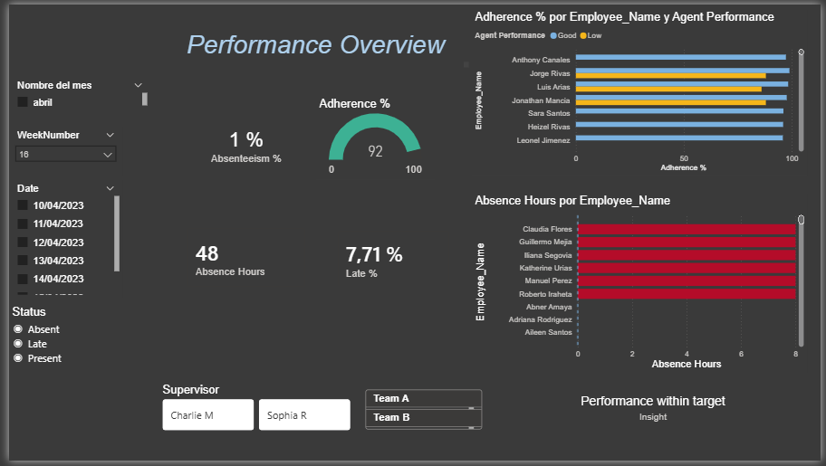
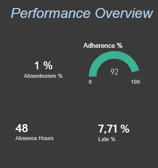
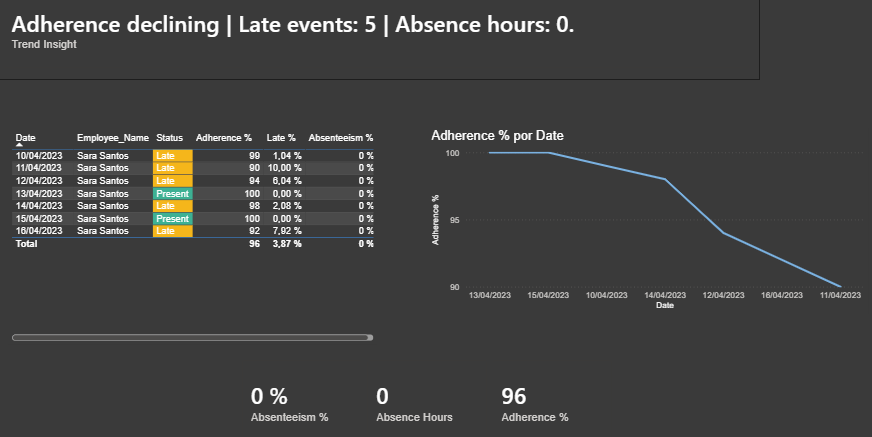
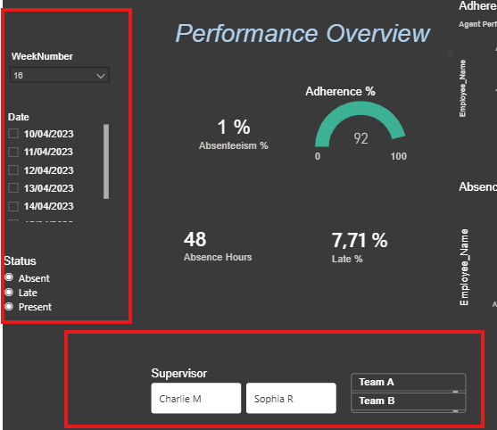

# Workforce Analytics Dashboard | Power BI Project

##  Business Problem

Workforce management teams often struggle to monitor agent performance, adherence, and absenteeism in a centralized and actionable way.

Data is usually scattered across multiple tools, making it difficult to identify performance gaps and take timely decisions.

---

## Objective

Develop an interactive Power BI dashboard that enables WFM teams and supervisors to:

* Monitor adherence and attendance in real time
* Identify low-performing agents
* Track absenteeism and tardiness trends
* Support operational decisions

---

##  Tools & Technologies

* Power BI
* Power Query (ETL)
* DAX (Data Analysis Expressions)
* Excel / SharePoint

---

##  Data Preparation

Data was transformed using Power Query with the following steps:

* Standardized time formats across datasets
* Handled OFF days using "00" logic for consistency
* Cleaned and normalized agent identifiers
* Created calculated columns for shift tracking and performance analysis

---

##  Key Metrics (KPIs)

* Adherence %
* Absenteeism (hours)
* Tardiness (minutes)
* Agent performance comparison

---

##  Dashboard Preview

### Overview

### Key Metrics

### Performance Trends

### Filters

---

##  Key Insights

* Identified agents with consistently low adherence
* Detected absenteeism patterns across time periods
* Highlighted operational inefficiencies affecting performance
* Enabled faster decision-making for supervisors

---

##  Technical Highlights

* Custom DAX measures for time and performance calculations
* Dynamic filtering using slicers
* Drillthrough functionality for detailed agent analysis
* Optimized data model for performance and scalability

---

##  What I Learned

This project strengthened my ability to:

* Translate business needs into data-driven solutions
* Build scalable and interactive dashboards
* Apply analytical thinking to workforce data
* Communicate insights effectively

---

##  Future Improvements

* Integration with real-time data sources
* Automation using Power Automate
* Predictive analytics for performance forecasting

---
## 🔒 Data Disclaimer
All data used in this project has been anonymized or generated for demonstration purposes.

No real employee names, personal information, or sensitive business data are included. This dashboard is intended solely to showcase technical and analytical skills in a safe and ethical manner.
